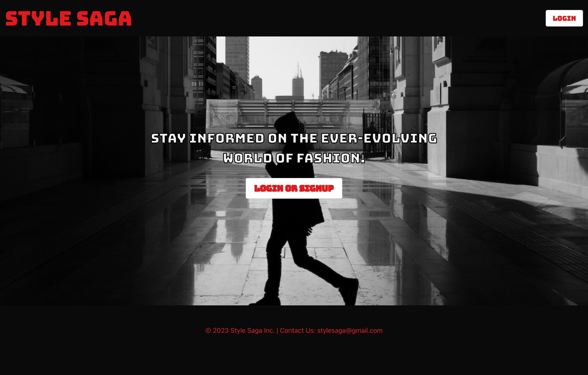

# Style Saga

## User Story

AS A street style fashion enthusiast
I WANT to access a fashion blog site where I can stay updated on the latest trends and styles
SO THAT I can be informed about the ever-evolving world of fashion 

## Description

Style Saga is a fashion blog for primarily street style fashion that allows users to stay informed on the ever-evolving world of fashion. Upon signing up/logging in, users can view a dashboard with several posts regarding certain looks, style aspects, etc. and can click to view the post in more detail and add a comment (this is where they will see other’s comments). The user’s profile page allows them to make a new post, as well as see the posts they have created. 

Don’t fall behind on the latest trends. Join Style Saga today. 

## Installation

N/A

## Usage

[Link to Deployed Site](https://rocky-harbor-10081-a01abff67a03.herokuapp.com/)

## Credits

By Carmen Regina, Giselle Fuselier, and Kevin Serrano in collaboration with Leif Hetland and Fred Kamm.

## License

Please refer to the LICENSE in the repo.